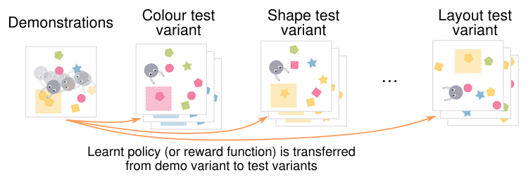
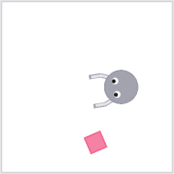
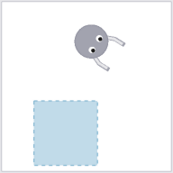
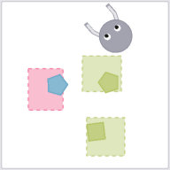
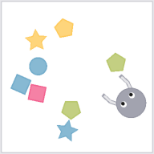

# Multitask Assessment of Generalisation in Imitative Control Algorithms (MAGICAL)

MAGICAL is a benchmark suite to evaluate the generalisation capabilities of
imitation learning algorithms.




## Installing and using MAGICAL

You can install MAGICAL using `pip`:

```#!sh
cd /path/to/this/directory
pip install -e .
```

MAGICAL tasks and variants are exposed as Gym environments. Once you've
installed MAGICAL, you can use the Gym environments as follows:

```python
import magical
import gym

# magical.register_envs() must be called before making any Gym envs
magical.register_envs()

# creating a demo variant for one task
env = gym.make('FindDupe-Demo-v0')
env.reset()
env.render(mode='human')
env.close()

# We can also make the test variant of the same environment, or add a
# preprocessor to the environment. In this case, we are creating a
# TestShape variant of the original environment, and applying the
# LoRes4E preprocessor to observations. LoRes4E stacks four
# egocentric frames together and downsamples them to 96x96.
env = gym.make('FindDupe-TestShape-LoRes4E-v0')
init_obs = env.reset()
print('Observation type:', type(obs))  # np.ndarray
print('Observation shape:', obs.shape)  # (96, 96, 3)
env.close()
```

Keep reading to see a list of all available tasks and variants, as well as all
the builtin observation preprocessors that ship with MAGICAL.

## Available tasks

 **MoveToCorner:**
Layout and CountPlus variants are unavailable for this task.

 **MoveToRegion:**
Shape and CountPlus variants are unavailable for this task.

 **MatchRegions:**

 **MakeLine:**

 **FindDupe:**

 **FixColour:**

 **ClusterColour:**

 **ClusterShape:**

## Available variants


## Preprocessors

The default observation type is a `dict` containing two keys, `ego` and `allo`,
corresponding to egocentric and allocentric views of the environment,
respectively. The values of this dictionary are 384×384 RGB images with the the
corresponding view. If you don't want to work with a dict of views for single
time steps, then you can also get observation spaces by appending one of the
following preprocessor names to the env name:

- `-LoResStack`: rather than showing only one image of the environment, values
  of the observation dict will contain the four most recent frames, concatenated
  along the channels axis. Additionally, observations will be resized to 96×96
  pixels.
- `-LoRes4E`: rather than having a dict observation space, observations will now
  be 96×96×12 numpy arrays containing only the four most recent egocentric
  views, stacked along the channels axis.
- `-LoRes4A`: like `-LoRes4E`, but with allocentric views instead of egocentric
  views.
- `-LoRes3EA`: like `-LoRes4E`, but contains the three most recent egocentric
  views concatenated with the most recent allocentric view. Useful for
  maintaining full observability of the workspace while retaining the
  ease-of-learning afforded by an egocentric perspective.
